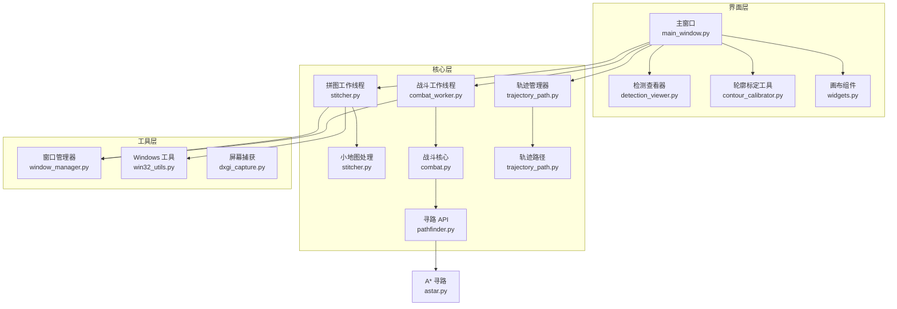

# LOTRO 项目 Code Wiki

## 1. 仓库概览

LOTRO 是一个针对《指环王Online》(The Lord of the Rings Online)游戏的自动化辅助工具，主要提供以下功能：

- **迷你地图拼接**：通过计算机视觉技术实时拼接游戏小地图，构建完整的游戏世界地图
- **YOLO 目标检测**：使用深度学习模型检测游戏中的怪物和其他目标
- **自动战斗系统**：基于检测结果自动进行战斗操作
- **轨迹寻路**：记录和跟随预设的移动路径
- **玩家朝向检测**：通过箭头检测确定玩家在游戏中的朝向

**典型应用场景**：自动练级、资源采集、地图探索

## 2. 目录结构

项目采用模块化设计，将不同功能组件分离到独立的目录中，便于维护和扩展。核心功能集中在 `Auto_Lotro3` 目录，包含 UI 界面、核心逻辑和工具类。

```text
lotro/
├── Auto_Lotro3/           # 主项目目录
│   ├── astar_pathfinder/  # A* 寻路算法实现
│   ├── core/              # 核心功能模块
│   ├── ui/                # 图形用户界面
│   ├── utils/             # 工具类和辅助函数
│   ├── calibrate_color.py # 颜色标定工具
│   ├── calibrate_minimap.py # 小地图标定工具
│   ├── lotro_arrow_v5.py  # 箭头检测模块
│   ├── main.py            # 主入口文件
│   └── test.py            # 测试文件
└── README.md              # 项目说明文件
```

**核心目录说明**：

| 目录/文件 | 职责 | 主要内容 |
|---------|------|--------|
| core/ | 核心功能实现 | 地图拼接、战斗逻辑、路径规划 |
| ui/ | 用户界面 | 主窗口、检测查看器、轮廓标定工具 |
| utils/ | 工具函数 | 窗口管理、屏幕捕获、系统操作 |
| astar_pathfinder/ | 寻路算法 | A* 路径搜索、网格地图处理 |

## 3. 系统架构与主流程

项目采用分层架构设计，将界面、核心逻辑和工具函数清晰分离，同时通过信号槽机制实现模块间的通信。

### 系统架构图



### 主要流程

1. **初始化流程**：
   - 启动主应用程序，加载 UI 界面
   - 初始化窗口管理器，准备捕获游戏窗口
   - 加载 YOLO 模型（如果需要）

2. **地图拼接流程**：
   - 捕获游戏窗口并框选小地图区域
   - 启动拼图工作线程，实时捕获小地图画面
   - 使用 SIFT 特征匹配和 FLANN 匹配器进行图像拼接
   - 在画布上显示拼接结果和玩家轨迹

3. **目标检测流程**：
   - 加载 YOLO 模型
   - 实时捕获游戏画面
   - 使用 YOLO 模型检测画面中的目标
   - 在检测查看器中显示检测结果

4. **自动战斗流程**：
   - 基于 YOLO 检测结果识别怪物
   - 使用状态机管理战斗状态（搜索、移动、攻击）
   - 自动释放技能和点击目标
   - 当没有目标时，沿预设轨迹巡逻

5. **轨迹寻路流程**：
   - 记录玩家移动轨迹
   - 保存轨迹到文件
   - 加载轨迹并自动跟随

## 4. 核心功能模块

### 4.1 迷你地图拼接

**功能说明**：通过计算机视觉技术实时拼接游戏小地图，构建完整的游戏世界地图。

**实现原理**：
- 使用 OpenCV 的 SIFT 算法提取小地图的特征点
- 使用 FLANN 匹配器进行特征点匹配
- 通过仿射变换计算相邻帧之间的位置关系
- 将小地图帧拼接到一个大画布上，形成完整地图

**关键代码**：
- [MiniMap 类](file:///workspace/lotro/Auto_Lotro3/core/stitcher.py#L14)：负责地图拼接的核心逻辑
- [StitchWorker 类](file:///workspace/lotro/Auto_Lotro3/core/stitcher.py#L193)：负责在后台线程中执行拼接操作

**使用示例**：
```python
# 初始化小地图处理
minimap = MiniMap()

# 更新小地图（添加新帧）
minimap.update(current_frame)

# 获取玩家位置
player_pos = minimap.get_player_position()

# 获取玩家朝向
player_angle = minimap.get_player_angle()
```

### 4.2 YOLO 目标检测

**功能说明**：使用 YOLO 深度学习模型检测游戏画面中的怪物和其他目标。

**实现原理**：
- 加载预训练的 YOLO ONNX 模型
- 实时捕获游戏画面
- 使用 YOLO 模型进行目标检测
- 处理检测结果，计算目标位置和置信度

**关键代码**：
- [MainWindow._load_yolo_model](file:///workspace/lotro/Auto_Lotro3/ui/main_window.py#L473)：加载 YOLO 模型
- [StitchWorker._run](file:///workspace/lotro/Auto_Lotro3/core/stitcher.py#L358)：执行目标检测

**使用示例**：
```python
# 加载 YOLO 模型
yolo_model = YOLO(model_path)

# 执行检测
results = yolo_model.predict(
    source=image,
    save=False,
    show=False,
    imgsz=1280,
    conf=0.5,
    verbose=False
)

# 处理检测结果
for r in results:
    for box in r.boxes:
        x1, y1, x2, y2 = map(int, box.xyxy[0])
        conf = float(box.conf[0])
        cls_id = int(box.cls[0])
```

### 4.3 自动战斗系统

**功能说明**：基于目标检测结果自动进行战斗操作，包括目标选择、移动和技能释放。

**实现原理**：
- 使用状态机管理战斗状态（空闲、搜索、巡逻、移动、战斗）
- 基于 YOLO 检测结果识别和选择目标
- 使用 A* 算法进行路径规划
- 自动释放技能和点击目标

**关键代码**：
- [CombatCore 类](file:///workspace/lotro/Auto_Lotro3/core/combat.py#L55)：战斗核心逻辑
- [CombatWorker 类](file:///workspace/lotro/Auto_Lotro3/core/combat_worker.py)：战斗工作线程

**使用示例**：
```python
# 初始化战斗核心
combat_core = CombatCore()

# 设置玩家位置
combat_core.set_player_position(x, y)

# 启动战斗
combat_core.start()

# 更新战斗状态
direction = combat_core.update(detections)
```

### 4.4 轨迹寻路

**功能说明**：记录和跟随预设的移动路径，实现自动导航。

**实现原理**：
- 记录玩家移动轨迹点
- 将轨迹保存到文件
- 加载轨迹并使用 A* 算法进行路径规划
- 自动控制角色移动到目标点

**关键代码**：
- [TrajectoryManager 类](file:///workspace/lotro/Auto_Lotro3/core/trajectory_path.py)：轨迹管理
- [PathFinderAPI 类](file:///workspace/lotro/Auto_Lotro3/core/pathfinder.py)：路径规划

**使用示例**：
```python
# 初始化轨迹管理器
traj_manager = TrajectoryManager(grid_size=5)

# 开始记录轨迹
traj_manager.start_recording()

# 停止记录并保存
traj_manager.stop_recording()
traj_manager.save_current_trajectory("route_001")

# 开始跟随轨迹
trajectory = traj_manager.load_trajectory("route_001")
traj_manager.start_following(trajectory)
```

### 4.5 玩家朝向检测

**功能说明**：通过检测游戏小地图中的箭头，确定玩家在游戏中的朝向。

**实现原理**：
- 捕获小地图画面
- 检测箭头的位置和方向
- 计算玩家朝向角度
- 应用平滑滤波减少抖动

**关键代码**：
- [lotro_arrow_v5.py](file:///workspace/lotro/Auto_Lotro3/lotro_arrow_v5.py)：箭头检测实现
- [StitchWorker._run](file:///workspace/lotro/Auto_Lotro3/core/stitcher.py#L292)：箭头检测集成

**使用示例**：
```python
# 检测箭头
res = arrow_v5.detect(arrow_frame)
if res:
    raw_angle = float(res["bearing"])
    game_angle = arrow_v5.smooth_filter(raw_angle)
    compass_dirs = ["N", "NE", "E", "SE", "S", "SW", "W", "NW"]
    compass = compass_dirs[int((game_angle + 22.5) // 45) % 8]
```

## 5. 核心 API/类/函数

### 5.1 MiniMap 类

**功能**：负责小地图的拼接和管理。

**主要方法**：
- `__init__(canvas_h=4000, canvas_w=4000)`：初始化小地图处理器
- `update(img)`：更新小地图，添加新帧
- `update_match_only(img)`：仅进行匹配，不更新画布
- `get_player_position()`：获取玩家当前在画布上的坐标
- `get_player_angle()`：获取玩家当前朝向
- `pixel_to_world(x, y)`：将像素坐标转换为画布世界坐标

**应用场景**：地图拼接、位置跟踪、路径规划

### 5.2 StitchWorker 类

**功能**：在后台线程中执行地图拼接和目标检测。

**主要方法**：
- `__init__(window_manager, region, minimap, yolo_model=None)`：初始化工作线程
- `start()`：启动工作线程
- `stop()`：停止工作线程
- `set_yolo_model(model)`：动态设置 YOLO 模型
- `set_yolo_detecting(detecting)`：设置是否启用检测
- `set_match_only(match_only)`：设置是否仅进行匹配

**应用场景**：后台地图拼接、实时目标检测

### 5.3 CombatCore 类

**功能**：战斗核心逻辑，管理战斗状态机。

**主要方法**：
- `__init__(config=None)`：初始化战斗核心
- `start()`：启动战斗
- `stop()`：停止战斗
- `update(detections)`：更新战斗状态
- `load_map_json(json_path)`：加载寻路地图
- `set_player_position(x, y)`：设置玩家位置
- `set_player_angle(angle)`：设置玩家朝向

**应用场景**：自动战斗、目标追踪、巡逻

### 5.4 TrajectoryManager 类

**功能**：管理轨迹的记录、保存和跟随。

**主要方法**：
- `__init__(grid_size=5)`：初始化轨迹管理器
- `start_recording()`：开始记录轨迹
- `stop_recording()`：停止记录轨迹
- `save_current_trajectory(name)`：保存当前轨迹
- `load_trajectory(name)`：加载轨迹
- `start_following(trajectory)`：开始跟随轨迹
- `stop_following()`：停止跟随轨迹
- `update(x, y, angle)`：更新轨迹跟随状态

**应用场景**：路径记录、自动导航、巡逻路线

### 5.5 WindowManager 类

**功能**：管理游戏窗口的捕获和操作。

**主要方法**：
- `bind_by_cursor()`：通过鼠标位置绑定窗口
- `bind_by_hwnd(hwnd)`：通过窗口句柄绑定窗口
- `bind_by_pid(pid)`：通过进程 ID 绑定窗口
- `is_valid()`：检查窗口是否有效
- `is_minimized()`：检查窗口是否最小化
- `bring_to_front()`：将窗口置于前台
- `get_info()`：获取窗口信息

**应用场景**：窗口捕获、坐标转换、窗口管理

### 5.6 PathFinderAPI 类

**功能**：提供路径规划功能，基于 A* 算法。

**主要方法**：
- `load_trajectory_json(json_path)`：加载轨迹 JSON 文件
- `start_pathfinding(start_pos, goal_pos)`：开始路径规划
- `update(player_pos, player_angle)`：更新路径规划
- `stop()`：停止路径规划
- `get_status()`：获取路径规划状态

**应用场景**：自动导航、路径规划、避障

### 5.7 KeySimulator 类

**功能**：模拟键盘和鼠标操作。

**主要方法**：
- `press_key(key)`：模拟按键
- `click_at(x, y)`：模拟鼠标点击

**应用场景**：自动操作、技能释放、目标选择

## 6. 技术栈与依赖

| 技术/依赖 | 用途 | 版本要求 | 来源 |
|---------|------|--------|------|
| Python | 编程语言 | 3.9+ | [Python.org](https://www.python.org/) |
| PySide6 | GUI 框架 | 最新版 | [PySide6](https://pypi.org/project/PySide6/) |
| OpenCV (opencv-contrib-python) | 计算机视觉 | 最新版 | [OpenCV](https://pypi.org/project/opencv-contrib-python/) |
| NumPy | 数值计算 | 最新版 | [NumPy](https://pypi.org/project/numpy/) |
| Ultralytics | YOLO 实现 | 最新版 | [Ultralytics](https://pypi.org/project/ultralytics/) |
| Windows API | 窗口操作 | Windows 系统 | 系统库 |

**安装命令**：
```bash
pip install PySide6 opencv-contrib-python numpy ultralytics
```

## 7. 关键模块与典型用例

### 7.1 迷你地图拼接

**功能说明**：将游戏小地图实时拼接成完整的世界地图。

**配置与依赖**：
- 需要先捕获游戏窗口并框选小地图区域
- 依赖 OpenCV 的 SIFT 和 FLANN 模块

**使用示例**：

1. 启动应用程序
2. 点击「捕获窗口」按钮，将鼠标移到游戏窗口并按 F1
3. 点击「绑定窗口」按钮
4. 点击「截取初始地图」按钮，框选小地图区域
5. 点击「开始拼图」按钮，开始地图拼接

**常见问题与解决方案**：
- 拼图失败：检查小地图区域是否正确框选，确保游戏窗口未最小化
- 拼接错位：调整偏移修正参数，确保小地图区域准确

### 7.2 自动战斗

**功能说明**：自动检测怪物并进行战斗。

**配置与依赖**：
- 需要加载 YOLO 模型（默认路径：`G:\Auto_Lotro\best.onnx`）
- 需要先绑定游戏窗口
- 可选：加载地图数据用于巡逻

**使用示例**：

1. 点击「加载 YOLO 模型」按钮
2. 点击「开始检测」按钮
3. 点击「📂 加载地图」按钮（可选）
4. 点击「⚔️ 开始打怪」按钮，开始自动战斗

**常见问题与解决方案**：
- 模型加载失败：检查模型文件路径是否正确
- 检测不到怪物：调整置信度阈值，确保怪物在视野内
- 战斗不流畅：调整技能释放间隔和攻击范围

### 7.3 轨迹寻路

**功能说明**：记录和跟随移动轨迹，实现自动导航。

**配置与依赖**：
- 需要先绑定游戏窗口
- 可选：加载地图数据用于显示

**使用示例**：

1. 在「轨迹名称」输入框中输入轨迹名称
2. 点击「🔴 开始记录」按钮，开始记录移动轨迹
3. 在游戏中移动，完成路径后点击「⏹️ 停止记录」按钮
4. 点击「💾 保存轨迹」按钮，保存轨迹
5. 点击「▶️ 开始跟随」按钮，开始自动跟随轨迹

**常见问题与解决方案**：
- 跟随失败：确保轨迹点足够密集，避免跨越障碍物
- 位置偏差：调整地图偏移参数，确保坐标准确

## 8. 配置、部署与开发

### 8.1 配置文件

项目主要通过 UI 界面进行配置，无需修改代码。关键配置包括：

- **YOLO 模型路径**：默认路径为 `G:\Auto_Lotro\best.onnx`，可在 `main_window.py` 中修改
- **地图保存目录**：默认路径为 `G:\map`，可在 `main_window.py` 中修改
- **战斗配置**：通过 UI 界面调整技能键位数量和攻击范围

### 8.2 部署步骤

1. 安装依赖：
   ```bash
   pip install PySide6 opencv-contrib-python numpy ultralytics
   ```

2. 准备 YOLO 模型：
   - 下载或训练 YOLO 模型
   - 将模型文件命名为 `best.onnx` 并放置在 `G:\Auto_Lotro\` 目录

3. 运行应用程序：
   ```bash
   cd Auto_Lotro3
   python main.py
   ```

### 8.3 开发环境

**推荐开发工具**：
- PyCharm 或 VS Code
- Python 3.9+
- Git

**开发流程**：
1. 克隆仓库
2. 创建虚拟环境
3. 安装依赖
4. 运行应用程序进行测试
5. 修改代码并测试
6. 提交更改

## 9. 监控与维护

### 9.1 日志系统

项目使用内置的日志系统记录运行状态和错误信息：
- 日志显示在应用程序的日志窗口中
- 同时输出到控制台
- 关键操作和错误会有详细记录

### 9.2 常见问题与解决方案

| 问题 | 可能原因 | 解决方案 |
|-----|---------|--------|
| 窗口捕获失败 | 游戏窗口未激活 | 确保游戏窗口在前台，按 F1 时鼠标在游戏窗口上 |
| 拼图失败 | 小地图区域不正确 | 重新框选小地图区域，确保包含完整的小地图 |
| 检测不到怪物 | YOLO 模型未加载或置信度过高 | 检查模型路径，调整置信度阈值 |
| 战斗不自动释放技能 | 技能键位配置错误 | 在 UI 中调整技能键位数量 |
| 轨迹跟随失败 | 轨迹点不足或地图未加载 | 记录更多轨迹点，确保加载了正确的地图数据 |

### 9.3 性能优化

- **CPU 使用率**：拼图和检测操作较为消耗 CPU，建议在高性能计算机上运行
- **内存使用**：地图拼接会占用较多内存，特别是拼接大地图时
- **帧率优化**：默认捕获帧率为 4 FPS，可根据计算机性能调整

## 10. 总结与亮点回顾

LOTRO 项目是一个功能丰富的游戏辅助工具，具有以下亮点：

1. **先进的计算机视觉技术**：使用 SIFT 特征匹配和 FLANN 匹配器实现高精度地图拼接
2. **深度学习集成**：集成 YOLO 目标检测，实现智能怪物识别
3. **完整的状态机系统**：使用状态机管理战斗流程，逻辑清晰
4. **路径规划算法**：集成 A* 寻路算法，实现智能导航
5. **用户友好的界面**：基于 PySide6 构建的现代化 GUI，操作简单直观
6. **模块化设计**：代码结构清晰，易于维护和扩展

项目展示了如何将计算机视觉、深度学习和路径规划等技术应用于游戏辅助工具开发，为游戏自动化提供了完整的解决方案。通过实时地图拼接、目标检测和自动战斗，显著提高了游戏效率，为玩家提供了更好的游戏体验。

**未来发展方向**：
- 优化 YOLO 模型，提高检测精度和速度
- 增加更多游戏功能的自动化支持
- 改进路径规划算法，支持更复杂的地形
- 开发跨平台版本，支持更多操作系统

LOTRO 项目不仅是一个实用的游戏辅助工具，也是计算机视觉和人工智能技术在游戏领域应用的典范。